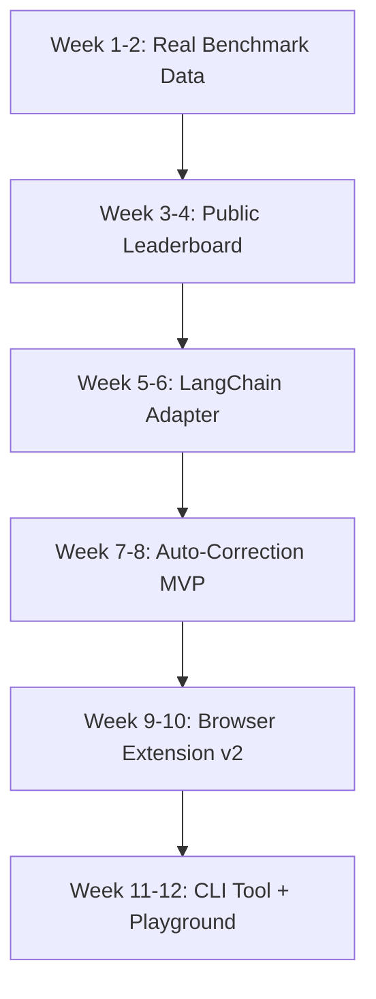

# HalluciGuard: Viral Growth Strategy & Feature Roadmap

Based on analysis of the current codebase and market positioning, here are the recommended features and polish areas to make HalluciGuard go viral.

---

## Current State Analysis

### Strengths
- Solid core architecture with multi-provider support
- RAG-aware verification already implemented
- Browser extension foundation exists
- Trust badge SVG generator ready
- Caching layer reduces costs

### Gaps
- Leaderboard has placeholder data (all 0.5 scores)
- Browser extension is basic (polling-based)
- No auto-correction capability
- Limited framework adapters

---

## Priority 1: High-Impact Viral Features

### 1.1 Public Hallucination Leaderboard (v0.9)

**Why it will go viral:**
- People love rankings and comparisons
- Gets shared on Twitter/LinkedIn/Hacker News
- Positions HalluciGuard as the authority on AI reliability

**What to build:**
```
halluciGuard/
├── leaderboard/
│   ├── __init__.py
│   ├── benchmark.py      # Standardized test suite
│   ├── categories.py     # Medical, Legal, Code, General
│   └── exporter.py       # Generate JSON/HTML leaderboard
```

**Implementation:**
1. Create a standardized benchmark dataset with 100+ test cases across categories
2. Run benchmarks automatically via CI/CD weekly
3. Generate a static HTML page with sortable tables
4. Add shareable badges for model creators

**Viral hook:** "GPT-5.3 hallucinates 3x more than Claude Opus 4.6 on medical facts"

---

### 1.2 One-Line Framework Adapters

**Why it will drive adoption:**
- Reduces Time to Hello World to < 30 seconds
- Developers share easy integrations

**Adapters to build:**

| Package | Integration Point | Example |
|---------|------------------|---------|
| `halluciGuard-langchain` | CallbackHandler | `llm.callbacks = [HalluciGuardHandler()]` |
| `halluciGuard-llamaindex` | Postprocessor | `index.as_query_engine(node_postprocessors=[HalluciGuardPostprocessor()])` |
| `halluciGuard-haystack` | Component | `pipeline.add_node(HalluciGuardComponent(), name="guard")` |
| `halluciGuard-vercel` | Middleware | `export const config = { middleware: halluciGuard }` |

---

### 1.3 Hallucination Auto-Correction (Lookahead)

**Why it transforms the product:**
- Moves from monitoring to fixing
- Creates must-have value proposition

**Implementation approach:**
```python
class AutoCorrectingGuard(Guard):
    def chat_with_correction(self, model, messages, **kwargs):
        response = self.chat(model, messages, **kwargs)
        
        # For each flagged claim, attempt correction
        for claim in response.flagged_claims:
            if claim.confidence < 0.3 and claim.sources:
                correction = self._find_correction(claim, claim.sources)
                response.content = response.content.replace(claim.text, correction)
        
        return response
```

---

## Priority 2: Polish for Production Readiness

### 2.1 Browser Extension v2

**Current issues:**
- Polling-based (inefficient)
- Requires local server
- Basic UI

**Improvements:**
1. Use MutationObserver instead of polling
2. Add options page for API key configuration
3. Support both local server AND direct API calls
4. Add inline highlighting of flagged claims
5. Publish to Chrome Web Store and Firefox Add-ons

---

### 2.2 Real Benchmark Data

**Current state:** All models show 0.5 scores (placeholder)

**Action items:**
1. Create benchmark test suite with ground truth
2. Run against actual models with API keys
3. Update leaderboard.json with real data
4. Add confidence intervals

---

### 2.3 Enhanced Error Messages

**Add actionable error messages:**
```python
# Instead of:
raise ValueError("client must be provided")

# Use:
raise ClientInitializationError(
    "OpenAI client not initialized.\n"
    "Solutions:\n"
    "  1. Set OPENAI_API_KEY environment variable\n"
    "  2. Pass api_key='sk-...' to Guard()\n"
    "  3. Pass client=OpenAI() to Guard()"
)
```

---

## Priority 3: Developer Experience

### 3.1 Interactive Playground

Create a web-based demo at `halluciguard.io/playground`:
- Paste any AI-generated text
- See instant hallucination analysis
- Share results via URL

### 3.2 CLI Tool

```bash
# Install
pip install halluciGuard[cli]

# Analyze a file
halluciGuard analyze output.txt --provider openai

# Run benchmark
halluciGuard benchmark --models gpt-4o,claude-sonnet-4.6

# Start server
halluciGuard serve --port 8000
```

### 3.3 Better Documentation

- API reference with auto-generated docs
- Integration guides for each framework
- Video tutorials
- Comparison page vs. alternatives

---

## Priority 4: Enterprise Features

### 4.1 Shadow Mode (ROI Calculator)

Run silently and report:
- Number of potential hallucinations caught
- Estimated cost of errors prevented
- Risk breakdown by category

### 4.2 Audit Dashboard

- Real-time monitoring
- Historical trends
- Export to SIEM systems
- SSO integration

---

## Recommended Execution Order



---

## Viral Marketing Hooks

1. **Leaderboard Launch:** Submit to Hacker News with title: "I benchmarked 15 LLMs for hallucinations. The results surprised me."

2. **Auto-Correction Demo:** Create viral video showing GPT-4 making a factual error and HalluciGuard fixing it in real-time.

3. **Framework Adapters:** Create 30-second integration videos for each framework.

4. **Open Source Credibility:** Publish research paper on hallucination detection methodology.

---

## Metrics to Track

| Metric | Target | Current |
|--------|--------|---------|
| GitHub Stars | 10,000 | - |
| PyPI Downloads | 100K/month | - |
| Twitter Mentions | 500/week | - |
| Hacker News Front Page | 3 posts | 0 |
| Framework Integrations | 5 | 2 |

---

## Summary

**Immediate wins:**
1. Fill leaderboard with real benchmark data
2. Build LangChain adapter (most popular framework)
3. Polish browser extension for Chrome Store

**Game-changers:**
1. Auto-correction feature
2. Public leaderboard with weekly updates
3. Interactive playground

**Long-term moat:**
1. Global hallucination dataset (community-contributed)
2. Enterprise dashboard
3. Model certification program
